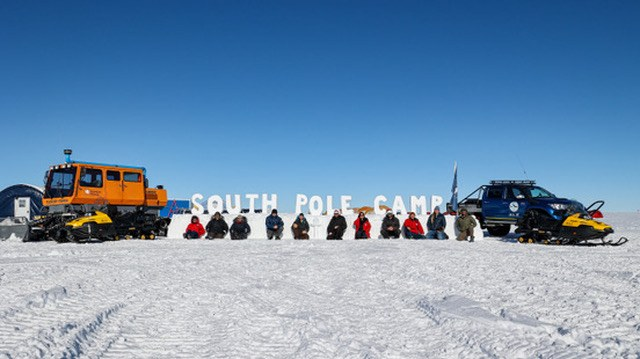

```{=html}
<header class="page-head">
<div class="wrap">
<p class="eyebrow">Fieldwork</p>
<h1>Fieldwork</h1>
<p class="lead"> As seismologists, we probe deep into the Earth with seismic waves—but sometimes, we literally have to dig. </p>
</div>
</header>

<section class="section wrap">
<div class="gallery-lead">
<div>
<p class="eyebrow">South Pole, Antarctica · 2024–2026</p>
<h2>Two austral field seasons.</h2>
<p>As part of the Antarctica Polar Array, I worked on large-N nodal array deployment and recovery, broadband station servicing, array and profile design, and remote-field operations.</p>
<p>I served as Field Team Lead during the 2025–2026 season.</p>
<a class="text-link" href="research.html#antarctica">The research beneath the fieldwork</a>
</div>
<figure>

<figcaption>A red tent beneath a solar halo in Antarctica.</figcaption>
</figure>
</div>
<div class="gallery">
<figure>

<figcaption>Field operations on the Antarctic snow surface.</figcaption>
</figure>
<figure>

<figcaption>Working beside a vehicle during Antarctic field operations.</figcaption>
</figure>
<figure class="portrait">

<figcaption>Excavating a snow pit for broadband station work.</figcaption>
</figure>
<figure>

<figcaption>A red tent on the Antarctic snow surface.</figcaption>
</figure>
<figure class="wide">

<figcaption>At South Pole Camp with the field team.</figcaption>
</figure>
</div>
</section>
<section class="section tinted">
<div class="wrap intro-grid">
<div>
<p class="eyebrow">Kenya · 2024</p>
<h2>Seismic field deployment.</h2>
</div>
<div>
<p>I deployed approximately 80 SmartSolo nodes and contributed to survey design and field data acquisition.</p>
<p class="small">Across field settings, my experience connects survey design, instrumentation, and data acquisition with the questions we ask of the subsurface.</p>
</div>
</div>
</section>
```
