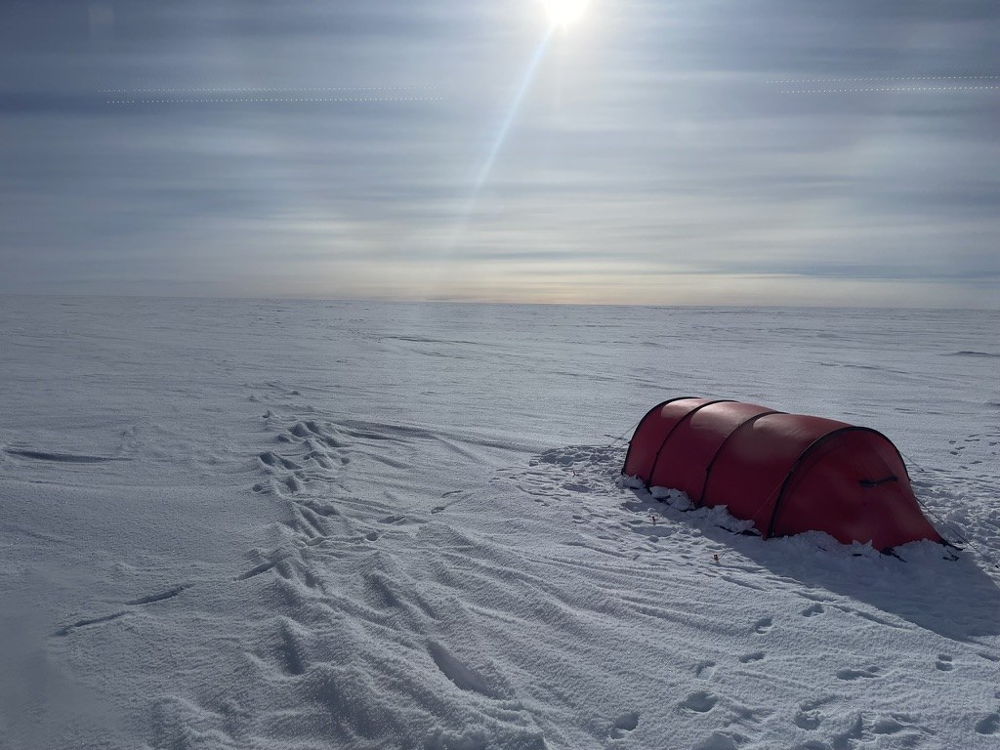
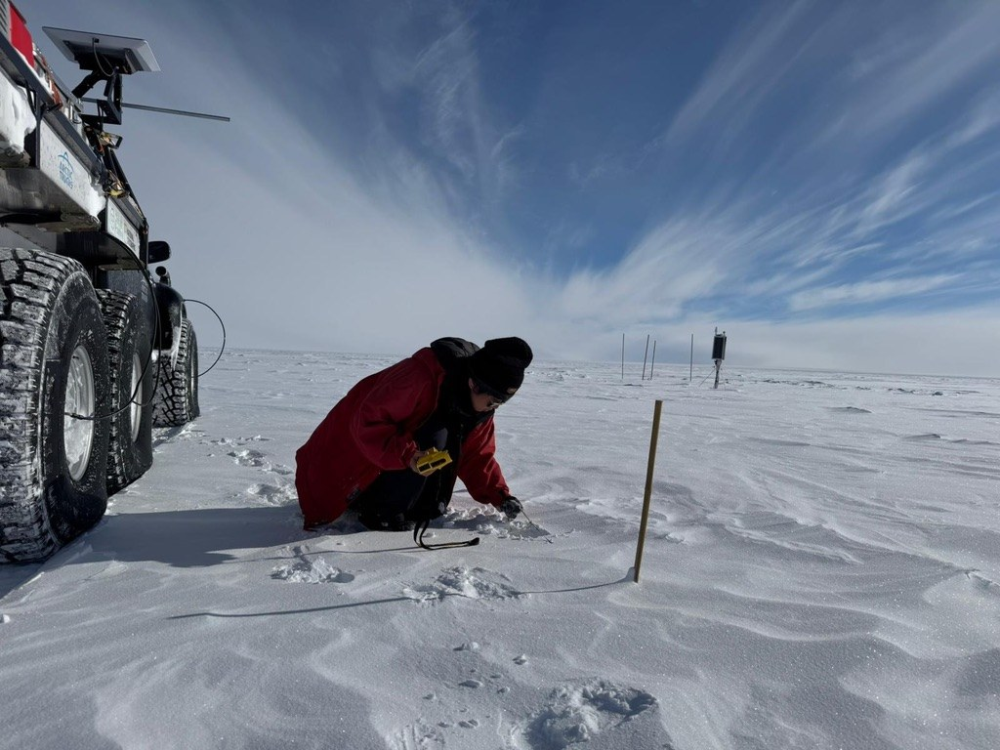
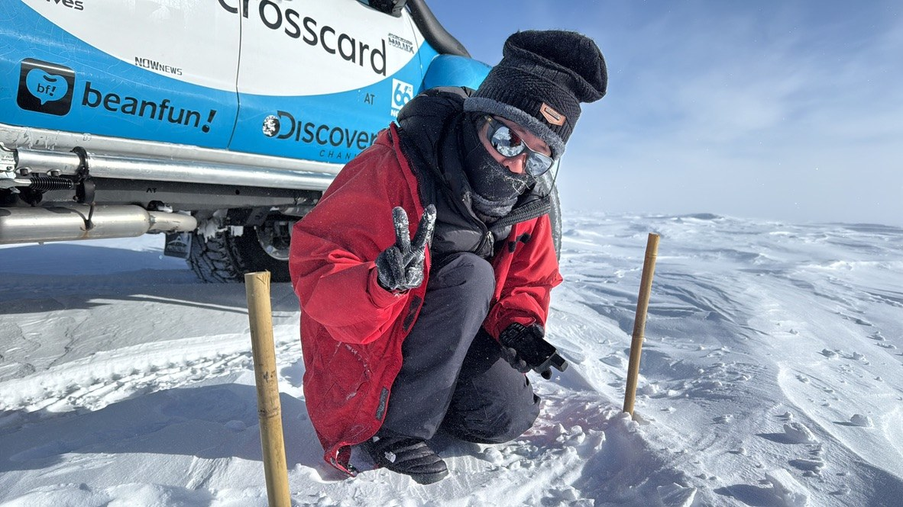
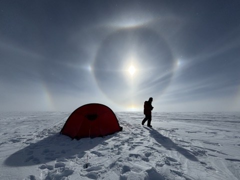
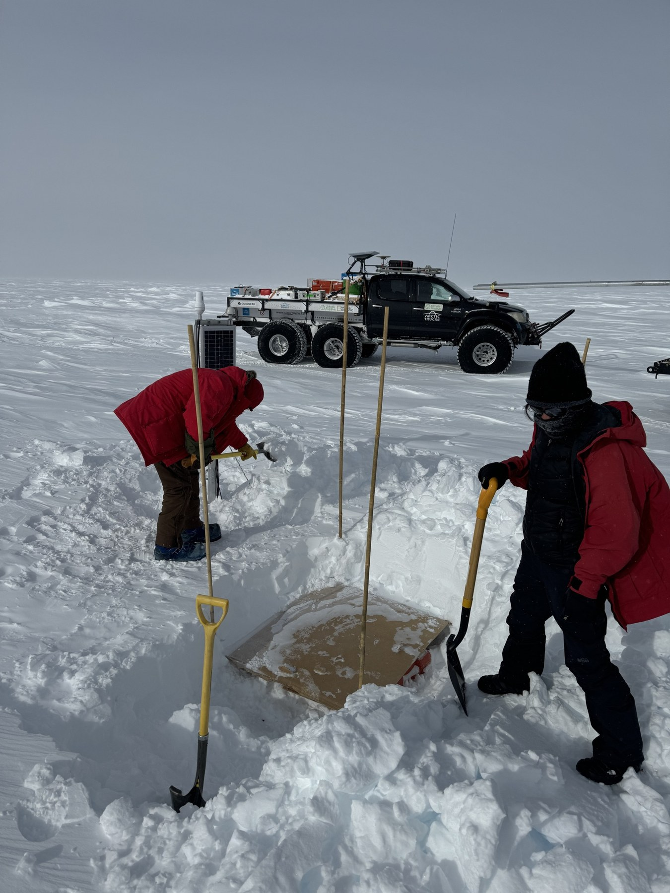

```{=html}
<section class="hero" aria-labelledby="home-title">

<div class="wrap">
<div class="hero-content">
<p class="eyebrow">Stony Brook University · Geophysics</p>
<h1 id="home-title">Hanxiao Wu</h1>
<p class="role">Seismologist</p>
<p class="intro">Using seismic observations to explore subsurface structure and physical properties.</p>
<div class="button-row">
<a class="button" href="research.html">Explore my research</a>
<a class="text-link" href="cv.html">Curriculum vitae</a>
</div>
</div>
</div>
<span class="photo-credit">ANTARCTICA / FIELDWORK</span>
</section>
<section class="section wrap intro-grid">
<div>
<p class="eyebrow">Research perspective</p>
<h2>What can geophysical observations tell us about the subsurface?</h2>
</div>
<div>
<p>I am a Ph.D. candidate in Geophysics at Stony Brook University, working with Weisen Shen. Much of my doctoral research develops and applies seismic methods to investigate subsurface structure, from the continental crust to the Antarctic subglacial environment.</p>
<p>I am interested in what seismic observations can reveal beyond seismic structure itself: how far can we go in inferring material composition, porosity, and physical state, and where do the uncertainties remain?</p>
<p class="small">My research has a growing focus on polar environments. A future direction is to integrate seismic and radar observations to better constrain subglacial properties and conditions.</p>
</div>
</section>
<section class="section tinted">
<div class="wrap">
<div class="section-top">
<div>
<h2>Research</h2>
</div>
<a class="text-link" href="research.html">View research</a>
</div>
<article class="feature-grid">
<a href="research.html#antarctica" aria-label="Explore Antarctic subglacial geophysics">

</a>
<div>
<p class="number">01 / POLAR GEOPHYSICS</p>
<h3>Beneath the Antarctic Ice Sheet</h3>
<p>What lies beneath kilometers of ice—and how does it shape conditions at the ice–bed interface?</p>
<p class="quiet">Using seismic observations to investigate subglacial sediments and explore what their properties reveal about water and basal conditions.</p>
<a class="text-link" href="research.html#antarctica">Antarctic subglacial geophysics</a>
</div>
</article>
<div class="research-pair">
<article>
<p class="number">02 / CONTINENTAL IMAGING</p>
<h3>Seeing the crust through complementary observations</h3>
<p>Joint inversion of seismic observables to constrain crustal structure and reduce parameter trade-offs.</p>
<a class="text-link" href="research.html#continental">Seismic imaging &amp; joint inversion</a>
</article>
<article>
<p class="number">03 / COMPUTATIONAL METHODS</p>
<h3>Understanding what our models can resolve</h3>
<p>Bayesian inversion, scalable computation, and uncertainty quantification for geophysical imaging.</p>
<a class="text-link" href="research.html#computational">Computational geophysics &amp; uncertainty</a>
</article>
</div>
</div>
</section>
<section class="section wrap">
<div class="section-top">
<div>
<p class="eyebrow">In the field</p>
<h2>Science begins with observation.</h2>
</div>
<a class="text-link" href="fieldwork.html">Fieldwork in Antarctica</a>
</div>
<p class="field-intro">Two austral field seasons at the South Pole, deploying and recovering dense nodal arrays, servicing broadband stations, and working across the Antarctic interior.</p>
<div class="field-strip">
<figure>

<figcaption>Working on the ice</figcaption>
</figure>
<figure>

<figcaption>A moment between observations</figcaption>
</figure>
<figure>

<figcaption>Broadband station fieldwork</figcaption>
</figure>
</div>
</section>
<section class="section tinted">
<div class="wrap">
<div class="section-top">
<div>
<p class="eyebrow">Selected work</p>
<h2>Publications &amp; manuscripts.</h2>
</div>
<a class="text-link" href="publications.html">All publications</a>
</div>
<article class="publication">
<div>
<span class="badge">Under review</span>
</div>
<div>
<h3>A Water-Rich Sedimentary Aquifer System Beneath the South Pole Controls Basal Conditions of the Antarctic Ice Sheet</h3>
<p>
<strong>Wu, H.</strong>, et al. · Manuscript under review at <em>Science</em>.</p>
</div>
</article>
<article class="publication">
<div class="year">2024</div>
<div>
<h3>
<a href="https://doi.org/10.1029/2023JB027952">Incorporating H-κ Stacking with Monte Carlo Joint Inversion of Multiple Seismic Observables: A Case Study for the Northwestern US</a>
</h3>
<p>
<strong>Wu, H.</strong>, Sui, S., and Shen, W. · <em>Journal of Geophysical Research: Solid Earth</em>
</p>
</div>
</article>
</div>
</section>
<section class="contact-band">
<div class="wrap">
<div>
<h2>Get in touch.</h2>
<p>Department of Geosciences · Stony Brook University</p>
</div>
<a class="text-link" href="mailto:hanxiao.wu@stonybrook.edu">hanxiao.wu@stonybrook.edu</a>
</div>
</section>
```
